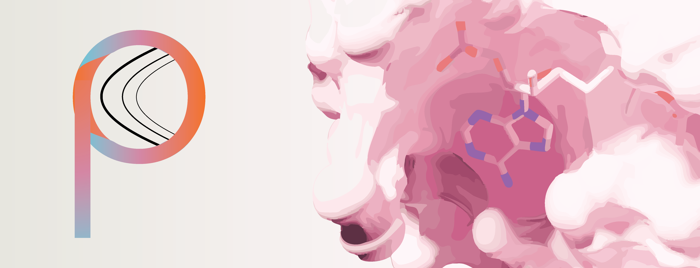
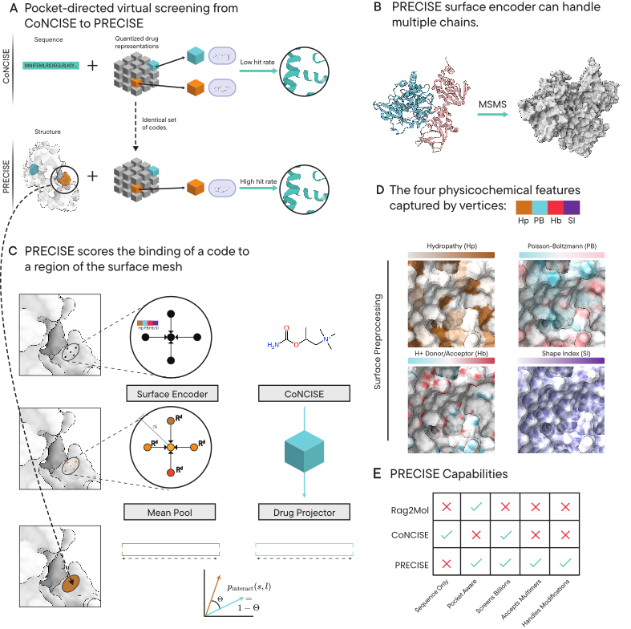

# PRECISE

Contemporary drug-screening pipelines struggle to perform two operations simultaneously: (a) leveraging extremely large databases of synthesizable ligands such as ZINC and Enamine, and (b) conducting targeted screening against a specific protein receptor site. Here, we introduce PRECISE, a machine-learning framework that achieves both by reimagining protein–ligand binding as an association between quantized ligand features and a protein-surface representation. At a very low level, PRECISE accepts a protein structure (via PDB) and a ligand SMILES string, internally converts the structure into a protein surface representation enriched with physicochemical and geometric features, and transforms the ligand into a discretized representation, ultimately integrating them to produce a per-vertex binding likelihood. For each surface-mesh vertex, PRECISE computes four key properties: (a) hydropathy, (b) hydrogen-bond donor–acceptor characteristics, (c) surface electrostatics, and (d) a shape index capturing local curvature. Ligand discretization is performed using CoNCISE, an ML model developed by our lab in 2024 (Erden et al., 2024), which enables PRECISE to efficiently screen entire ligand libraries at scale. This fundamental operation supports higher-level operations such as (a) ligand-specific binding-site prediction on proteins and (b) site-specific identification of potential ligand binders for any target, and it further exhibits robust zero-shot generalization to challenging systems including metalloproteins and multi-chain complexes.



In the PRECISE paper, we demonstrate that PRECISE performs on par with state-of-the-art co-folding and ML-based docking approaches in identifying ligand-binding sites. We also show that our screening pipeline, which employs an efficient Markov Chain Tree Search (MCTS) strategy, can capitalize on the scale and chemical diversity of large ligand databases to identify Vina-inferred strong binders while requiring only minimal docking.

### Biorxiv

### Citing PRECISE

### Getting Started

To install the environment for inference, you need to install via the following codes:

```
micromamba create -f environment.yml
micromamba activate precise

pip install torch-geometric \
  torch-scatter \
  torch-sparse \
  torch-cluster \
  torch-spline-conv \
  -f https://data.pyg.org/whl/torch-2.5.1+cu121.html

pip install -e .
```

Also, for the surface calculation, you need to install the tools via the following codes:

```
precise install-tools
```

### Usage

At a high level, PRECISE gives users access to three main interfaces:
1. **Surface tool**: for constructing protein surfaces from protein structural input (PDB). It can also compute surfaces of PDBs representing protein multimers; these surface representations are responsive to PTMs and other non-polymeric entities like metalloproteins.
2. **Pocket detection tool**: which accepts a protein structure and a ligand, and identifies surface regions which PRECISE infers to be the most likely binding locations (ligand-based pocket detection). As in 1, it can accept composite structues like multimers and structures with PTMs.
3. **Ligand screening tool**: which accepts a protein structure, the site in the protein structure to target, and a **ligand database**, returning a set of SMILES, enriched for Vina docking scores, that PRECISE predicts as possible site-specific binding candidates.   

#### Create surface
After running the `precise install-tools` command, users are then able to generate surface meshes with added physicochemical properties. The following command lets user to construct surfaces from a specific chain:
```
precise create-surface --chain-id A --pdb-path ./example/2QCS.pdb
```
For multi-chain surface construction, the `--chain-id` parameter can be updated the following way:
```
precise create-surface --chain-id A,B --pdb-path ./example/2QCS.pdb
```
This will return the protein surface in the form of a `ply` file at the location [MERT TODO]


#### Detecting pockets
Given a protein PDB and a ligand SMILE, the users can identify PRECISE-inferred high likelihood binding locations using the following command:
```
precision detect-pockets --pdb-path ./example/3WBB.pdb --smiles 'CCO'
```
The output is in the form of a `json` file, which is returned at the [MERT TODO] location. 

This interface also gives users the ability to visualize PRECISE predictions at every surface patch regions, through a surface ply file, by adding a `--visualize` option. The output `ply` file containing the PRECISE surface predictions are saved at [MERT TODO] locations.
```
precision detect-pockets --pdb-path ./example/3WBB.pdb --smiles 'CCO' --visualize
```

#### Ligand Database screening

Finally, PRECISE lets users screen for a potential site-specific binding tagets against ligand databases using the `virtual-screen` interface. The protein structure information is passed through a PDB file, while the site information can be provided either through exact coordinate information or through a SDF file. 

```
# Example with SDF:
precise virtual-screen \
    --pdb-path ./example/3WBB.pdb \
    --output-dir results/ \
    --center-sdf ./example/3WBB_NAP.sdf \
    --search-mode wide \
    --no-codes-to-consider 500 \
    --no-smiles-per-codes 100
    --db-path zinc.db 

# Example with coordinates:
precise virtual-screen \
    --pdb-path ./example/3WBB.pdb \
    --output-dir results/ \
    --center-x 10.5 \
    --center-y 20.3 \
    --center-z 15.7 \
    --db-path zinc.db
```
If the `--db-path` is not set, this interface prompts the user if they want to download the ZINC(250M) database from huggingface. Once the file is downloaded the location can be used again to prevent re-downloading. 

Currently, we can perform virtual screening in two modes:
1. `wide`: which lets us explore more of the ligand tree, incurring larger computational docking costs (but ligand candidates enriched with better Vina docking scores)
2. `shallow`: which limits exploration but has lower computational docking costs.


<!-- LICENSE -->
## License
The copyrights of this software are owned by Tufts and Duke Universities. Two licenses for this software are offered:

1. An open-source license under the CC-BY-NC-SA 4.0 license for non-commercial academic use.

2. A custom license with the two universities, for commercial use or uses without the CC-BY-NC-SA 4.0 license restrictions. 

As a recipient of this software, you may choose which license to receive the code under.

To enter a custom license agreement without the CC-BY-NC-SA 4.0 license restrictions, please contact the Digital Innovations department at the Duke Office for Translation & Commercialization (OTC) (https://otc.duke.edu/digital-innovations/#DI-team) at otcquestions@duke.edu.

Please note that this software is distributed AS IS, WITHOUT ANY WARRANTY; and without the implied warranty of MERCHANTABILITY or FITNESS FOR A PARTICULAR PURPOSE.


<p align="right">(<a href="#readme-top">back to top</a>)</p>


<!-- CONTACT -->
## Contact

<a href="https://github.com/rohitsinghlab/CoNCISE/graphs/contributors">
  
</a>


<!-- MARKDOWN LINKS & IMAGES -->
<!-- https://www.markdownguide.org/basic-syntax/#reference-style-links -->
[forks-shield]: https://img.shields.io/github/forks/rohitsinghlab/CoNCISE.svg?style=for-the-badge
[forks-url]: https://github.com/rohitsinghlab/CoNCISE/network/members
[stars-shield]: https://img.shields.io/github/stars/rohitsinghlab/CoNCISE.svg?style=for-the-badge
[stars-url]: https://github.com/rohitsinghlab/CoNCISE/stargazers
[issues-shield]: https://img.shields.io/github/issues/rohitsinghlab/CoNCISE.svg?style=for-the-badge
[issues-url]: https://github.com/rohitsinghlab/CoNCISE/issues
[license-shield]: https://img.shields.io/github/license/rohitsinghlab/CoNCISE.svg?style=for-the-badge
[license-url]: https://github.com/rohitsinghlab/CoNCISE/blob/master/LICENSE

