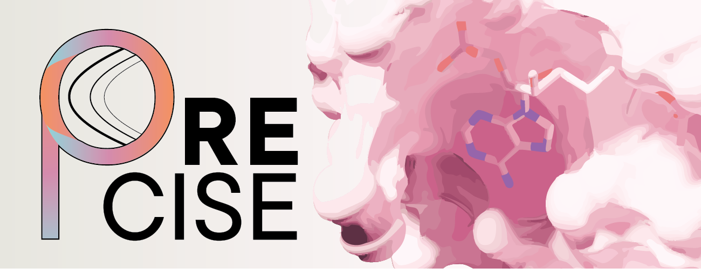
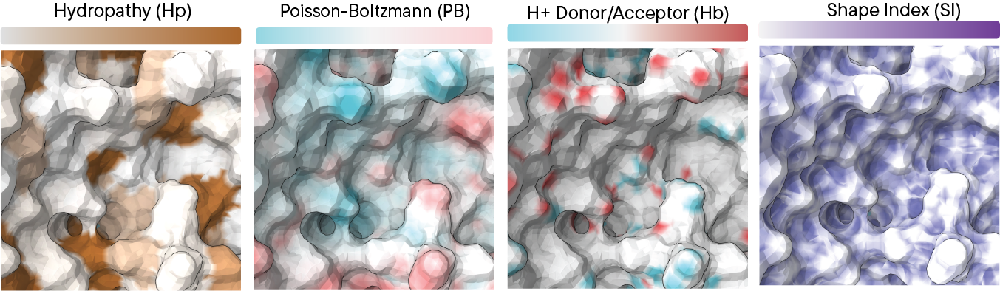
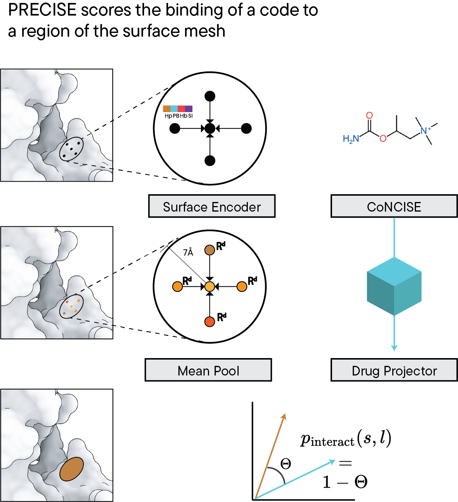

# Learning a PRECISE language for small-molecule binding

[](https://creativecommons.org/licenses/by-nc-sa/4.0/)

**PRECISE** is a machine-learning framework for large-scale protein-ligand virtual screening that enables targeted screening against specific protein receptor sites while leveraging massive synthesizable ligand databases (ZINC, Enamine).

## Table of Contents
- [Overview](#overview)
- [Installation](#installation)
- [Quick Start](#quick-start)
- [Usage](#usage)
  - [Surface Generation](#create-surface)
  - [Pocket Detection](#detecting-pockets)
  - [Virtual Screening](#ligand-database-screening)
- [Paper and Citation](#paper-and-citation)
- [License](#license)
- [Contact](#contact)

## Overview

Contemporary drug-screening pipelines struggle to perform two operations simultaneously: (a) leveraging extremely large databases of synthesizable ligands such as ZINC and Enamine, and (b) conducting targeted screening against a specific protein receptor site. 

PRECISE addresses this challenge by reimagining protein-ligand binding as an association between quantized ligand features and a protein-surface representation. The framework:

- **Accepts**: Protein structures (PDB format) and ligand SMILES strings
- **Processes**: Converts structures into enriched protein surface representations and transforms ligands into discretized features
- **Outputs**: Per-vertex binding likelihood predictions

### How It Works

For each surface-mesh vertex, PRECISE computes four key physicochemical properties:
1. **Hydropathy**
2. **Hydrogen-bond donor-acceptor characteristics**
3. **Surface electrostatics**
4. **Shape index** (local curvature)

<p align="center">
  
</p>

Ligand discretization is performed using **CoNCISE** (Erden et al., 2024), enabling efficient screening of entire ligand libraries at scale.

<p align="center">
  
</p>


## Paper and Citation

### Preprint
The PRECISE paper is available on bioRxiv: [Link coming soon]

### Citing PRECISE
If you use PRECISE in your research, please cite:

```bibtex

```

### Related Work
PRECISE builds upon CoNCISE for ligand discretization:
```bibtex
@article{erden2024concise,
  title={Learning a CoNCISE language for small-molecule binding},
  author={Erden, M. et al.},
  year={2024}
}
```

## Installation

### Requirements
- Python 3.10+
- CUDA 12.1+ (for GPU acceleration)
- [Micromamba](https://mamba.readthedocs.io/en/latest/installation/micromamba-installation.html) or [Conda](https://docs.conda.io/en/latest/miniconda.html)

### Step 1: Create Environment

First, create and activate the PRECISE environment:

```bash
micromamba create -f environment.yml
micromamba activate precise
```

### Step 2: Install PyTorch Geometric Dependencies

Install the PyTorch Geometric ecosystem packages:

```bash
pip install torch-geometric \
  torch-scatter \
  torch-sparse \
  torch-cluster \
  torch-spline-conv \
  -f https://data.pyg.org/whl/torch-2.5.1+cu121.html
```

> **Note**: Adjust the CUDA version (`cu121`) to match your system's CUDA installation if needed.

### Step 3: Install PRECISE

Install PRECISE in editable mode:

```bash
pip install -e .
```

### Step 4: Install Surface Calculation Tools

Install the required tools for protein surface calculation:

```bash
precise install-tools
```

This command will download and configure the necessary dependencies for surface mesh generation.

## Quick Start

Here's a simple example to get started with PRECISE:

```bash
# 1. Generate a protein surface (optional - automatically created if needed)
precise create-surface --pdb-path ./example/2QCS.pdb --chain-id A

# 2. Detect binding pockets for a ligand
precise detect-pockets --pdb-path ./example/3WBB.pdb --smiles 'CCO'

# 3. Screen a ligand database (will prompt to download ZINC if not available)
precise virtual-screen \
    --pdb-path ./example/3WBB.pdb \
    --output-dir results/ \
    --center-sdf ./example/3WBB_NAP.sdf \
    --search-mode shallow
```

> **Note**: The first time you run `detect-pockets` or `virtual-screen`, PRECISE will automatically download the pretrained model (~150MB) from HuggingFace Hub.

## Usage

PRECISE provides three main interfaces for protein-ligand analysis:

| Tool | Purpose | Input | Output |
|------|---------|-------|--------|
| **Surface Tool** | Generate protein surface meshes | PDB file | PLY mesh with properties |
| **Pocket Detection** | Find binding sites for ligands | PDB + SMILES | JSON with site predictions |
| **Virtual Screening** | Screen ligand databases | PDB + site + database | Ranked SMILES candidates |

### Create Surface


After running `precise install-tools`, you can generate surface meshes enriched with physicochemical properties.

#### Single Chain Surface

Generate a surface for a specific protein chain:

```bash
precise create-surface --pdb-path ./example/2QCS.pdb --chain-id A
```

**Output**: PLY file saved to `./example/2QCS_surface.ply` (same directory as PDB)

#### Multi-Chain Surface

For protein complexes, specify multiple chains (comma-separated):

```bash
precise create-surface --pdb-path ./example/2QCS.pdb --chain-id A,B
```

**Output**: PLY file saved to `./example/2QCS_A_B_surface.ply`


#### Optional Parameters

```bash
precise create-surface \
    --pdb-path ./example/2QCS.pdb \
    --chain-id A \
    --output-path ./custom_output/my_surface.ply \  # Custom output location
    --color
```

**Colored Visualization Output**: When using `--color`, creates visualizations in `colored_surfaces/`:
- `charge_{filename}.ply` - Electrostatic properties
- `hbond_{filename}.ply` - Hydrogen bond donor/acceptor
- `hphob_{filename}.ply` - Hydrophobicity
- `shape_index_{filename}.ply` - Surface curvature

---

### Detecting Pockets

Identify high-likelihood binding locations for a given ligand on a protein structure. This command automatically creates a surface if not present and uses MeanShift clustering to detect binding hotspots.

#### Basic Usage

```bash
precise detect-pockets --pdb-path ./example/3WBB.pdb --smiles 'CCO'
```

**What happens**:
1. Creates `surface.ply` in the same directory as the PDB (if not already present)
2. Computes binding likelihood for each surface vertex
3. Uses MeanShift clustering to identify hotspot regions
4. Prints results to console

**Console Output**: Displays clusters with residue IDs, scores, and centroids

#### Save Results to JSON

To save the full results including vertex scores:

```bash
precise detect-pockets \
    --pdb-path ./example/3WBB.pdb \
    --smiles 'CCO' \
    --output-json ./results/pockets.json
```

#### Visualization Mode

Generate a colored surface mesh showing binding predictions:

```bash
precise detect-pockets \
    --pdb-path ./example/3WBB.pdb \
    --smiles 'CCO' \
    --visualize \
    --output-path ./results/
```

**Output**: 
- Surface: `./example/surface.ply` (automatically created)
- Visualization: `./results/3WBB_binding_scores.ply` (colored by binding likelihood)

The visualization PLY file encodes binding likelihood as vertex colors (warm colors = higher likelihood).

> **Note**: Visualization requires a `surface.ply` file to exist in the PDB directory. It's automatically created during the inference.

#### Advanced Parameters

Fine-tune the hotspot detection:

```bash
precise detect-pockets \
    --pdb-path ./example/3WBB.pdb \
    --smiles 'CCO' \
    --threshold 0.35 \        # Score threshold for hotspot detection (default: 0.35)
    --bandwidth 12.0 \        # Bandwidth for MeanShift clustering (default: 12.0)
    --device cuda \           # Use GPU acceleration (default: cuda)
```

If `--checkpoint-path` is not provided, PRECISE will automatically download the pretrained model from HuggingFace Hub.

#### JSON Output Structure

```json
{
  "clusters": [
    {
      "residue_ids": ["A:TYR:123", "A:PHE:145", "A:GLU:167"],
      "cluster_size": 245,
      "average_score": 0.87,
      "centroid": [10.5, 20.3, 15.7]
    },
    {
      "residue_ids": ["A:LEU:201", "A:VAL:203"],
      "cluster_size": 156,
      "average_score": 0.72,
      "centroid": [15.2, 18.9, 22.1]
    }
  ],
  "mode": "d",
  "residue_ids": ["A:TYR:123", "A:PHE:145", "A:GLU:167"],
  "vertex_scores_d": [0.12, 0.87, 0.65, ...]
}
```

**Fields**:
- `clusters`: Detected binding sites ordered by average score
- `residue_ids`: Primary cluster's residue identifiers (highest scoring)
- `vertex_scores_d`: Per-vertex binding likelihood scores
- `mode`: Inference mode (`d` for standard, `qd` for quantized)

---

### Ligand Database Screening

Screen large compound libraries to identify potential site-specific binders using hierarchical clustering and tree-based docking with AutoDock Vina.

#### Pipeline Overview

The virtual screening pipeline performs:
1. **Surface Generation**: Creates protein surface representation
2. **Pocket Scoring**: PRECISE identifies promising molecular codes for the target site
3. **SMILES Retrieval**: Fetches candidate molecules from database
4. **Hierarchical Clustering**: Groups similar ligands into a tree structure
5. **Tree-based Docking**: Efficiently explores the tree with Vina docking

#### Specifying the Binding Site

You can define the target binding site using either:
1. **SDF file** (recommended): Provides structural context from a known ligand
2. **Coordinates**: Specify exact X, Y, Z coordinates

**Note**: These methods are mutually exclusive - use one or the other, not both.

#### Example 1: Screening with SDF File

```bash
precise virtual-screen \
    --pdb-path ./example/3WBB.pdb \
    --output-dir results/ \
    --center-sdf ./example/3WBB_NAP.sdf \
    --search-mode wide \
    --no-codes-to-consider 500 \
    --no-smiles-per-codes 100 \
    --db-path ~/.precise/zinc/zincv2.db
```

#### Example 2: Screening with Coordinates

```bash
precise virtual-screen \
    --pdb-path ./example/3WBB.pdb \
    --output-dir results/ \
    --center-x 10.5 \
    --center-y 20.3 \
    --center-z 15.7 \
    --search-mode wide \
    --db-path ~/.precise/zinc/zincv2.db
```

#### Database Setup

If `--db-path` is not provided, PRECISE will prompt you to download the **ZINC (250M compounds)** database. The download is interactive:

```bash
# First run without --db-path
precise virtual-screen \
    --pdb-path ./example/3WBB.pdb \
    --output-dir results/ \
    --center-sdf ./example/3WBB_NAP.sdf

# PRECISE will ask:
# > Would you like to download the ZINC database now? [Y/n]: y
# > Enter installation directory [~/.precise/zinc/]:

# Subsequent runs can reference the database
precise virtual-screen \
    --pdb-path ./example/3WBB.pdb \
    --output-dir results/ \
    --center-sdf ./example/3WBB_NAP.sdf \
    --db-path ~/.precise/zinc/zincv2.db
```

#### Search Modes

| Mode | Exploration | Docking Cost | Output Quality | Typical Time* |
|------|-------------|--------------|----------------|---------------|
| `wide` | Extensive tree exploration | Higher (~100-300 dockings) | Better Vina scores, more candidates | 30-90 min |
| `shallow` | Limited exploration | Lower (~50-100 dockings) | Faster results, fewer candidates | 10-15 min |

*On single GPU with default parameters (500 codes, 100 SMILES/code)

**Recommendation**: Use `wide` for final screening, `shallow` for rapid prototyping.

#### Output Files

Results are saved in the specified output directory:

```
results/
├── receptor.ply                                        # Generated protein surface
├── selected_smiles.csv                                 # SMILES retrieved from database (codes + probabilities)
├── docking_results_cluster_representatives.csv         # Final results with Vina scores
└── dendrogram.npy                                      # Hierarchical clustering tree (NumPy format)
```

**Key Output**: `docking_results_cluster_representatives.csv` contains:
- `smiles`: SMILES string
- `vina_scores`: Vina docking score (kcal/mol, lower is better)
- `code`: PRECISE molecular code
- `probability`: PRECISE binding probability

#### Advanced Parameters

```bash
precise virtual-screen \
    --pdb-path ./example/3WBB.pdb \
    --output-dir results/ \
    --center-sdf ./example/3WBB_NAP.sdf \
    --db-path ~/.precise/zinc/zincv2.db \
    --search-mode wide \
    --no-codes-to-consider 500 \              # Number of discrete codes to retrieve
    --no-smiles-per-codes 100 \               # SMILES to generate per code
    --max-per-depth 20 \                      # Max nodes to explore per tree depth
    --ligand-embedding conplex \              # Embedding method: 'mf' or 'conplex'
    --dist-thres 0.7 \                        # Clustering distance threshold
    --device 0 \                              # GPU device ID
```

#### Parameter Reference

| Parameter | Description | Default | Notes |
|-----------|-------------|---------|-------|
| `--no-codes-to-consider` | Number of molecular codes to retrieve | 500 | Higher = more diversity, slower |
| `--no-smiles-per-codes` | SMILES per code | 100 | Total candidates = codes × SMILES/code |
| `--search-mode` | Tree exploration strategy | `wide` | Use `shallow` for faster runs |
| `--max-per-depth` | Max tree nodes per depth | 20 | Controls branching factor |
| `--ligand-embedding` | Embedding method | `conplex` | `mf` = Morgan fingerprints, `conplex` = ConPLex learned embeddings |
| `--dist-thres` | Clustering distance threshold | 0.7 | Lower = more clusters |
| `--device` | GPU device ID | 0 | Use specific GPU (0, 1, 2, ...) |
| `--precise-chpt` | Model checkpoint path | Auto-download | Optional custom model |


## FAQ

<p align="center">
  
</p>

**Q: What databases are supported?**  
A: Currently ZINC (250M compounds). Custom databases can be used with the proper SQLite schema.

---

## License

The copyrights of this software are owned by **Tufts University** and **Duke University**. 

### Two License Options:

1. **Open-Source License**: [CC-BY-NC-SA 4.0](https://creativecommons.org/licenses/by-nc-sa/4.0/) for non-commercial academic use

2. **Commercial License**: Custom licensing for commercial use or uses without CC-BY-NC-SA 4.0 restrictions

As a recipient of this software, you may choose which license to receive the code under.


---

## Contact


### Contributors

<a href="https://github.com/rohitsinghlab/PRECISE/graphs/contributors">
  
</a>

---

## Acknowledgments

PRECISE builds upon:
- **CoNCISE** (Erden et al., 2024) for ligand discretization
- **AutoDock Vina** for docking validation
- The broader computational chemistry and ML communities

<p align="right">(<a href="#readme-top">back to top</a>)</p>


<!-- MARKDOWN LINKS & IMAGES -->
<!-- https://www.markdownguide.org/basic-syntax/#reference-style-links -->
[forks-shield]: https://img.shields.io/github/forks/rohitsinghlab/PRECISE.svg?style=for-the-badge
[forks-url]: https://github.com/rohitsinghlab/PRECISE/network/members
[stars-shield]: https://img.shields.io/github/stars/rohitsinghlab/PRECISE.svg?style=for-the-badge
[stars-url]: https://github.com/rohitsinghlab/PRECISE/stargazers
[issues-shield]: https://img.shields.io/github/issues/rohitsinghlab/PRECISE.svg?style=for-the-badge
[issues-url]: https://github.com/rohitsinghlab/PRECISE/issues
[license-shield]: https://img.shields.io/github/license/rohitsinghlab/PRECISE.svg?style=for-the-badge
[license-url]: https://github.com/rohitsinghlab/PRECISE/blob/master/LICENSE

